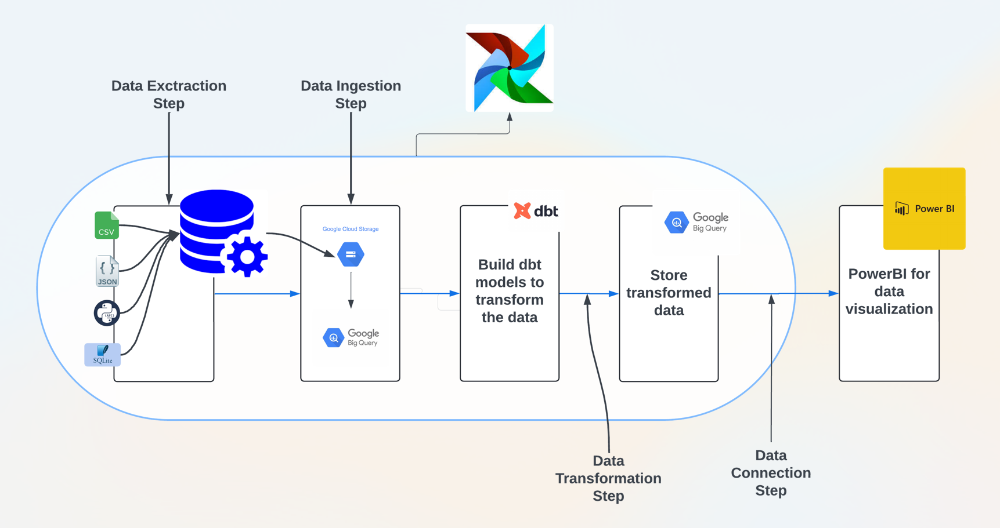
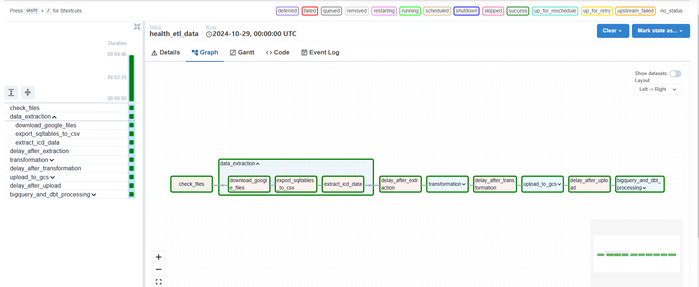
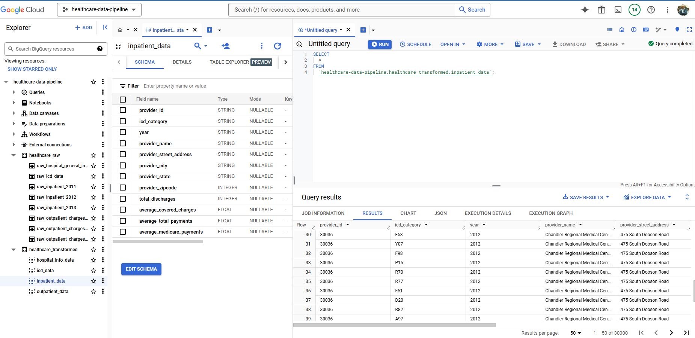
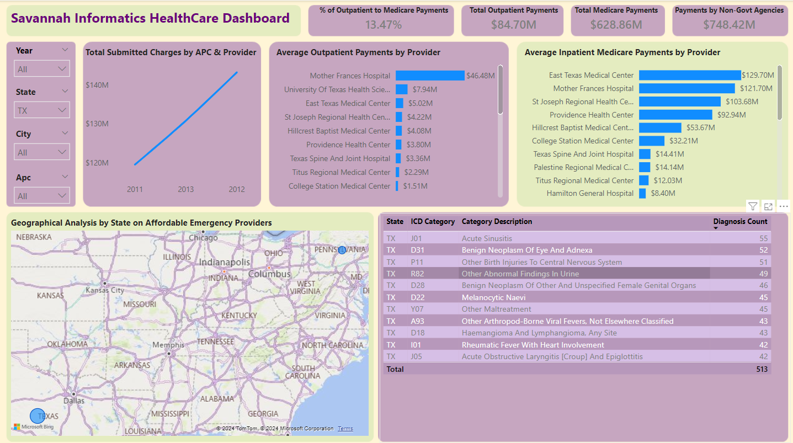

# Healthcare ETL Data Pipeline
 

This project is an ETL (Extract, Transform, Load) pipeline for processing healthcare data using [Apache Airflow](https://airflow.apache.org/). The pipeline automates tasks for data extraction, transformation, loading to Google Cloud Storage (GCS) and BigQuery, and further data processing with DBT (Data Build Tool) and connects to PowerBI for data visualization.

## Project Overview

This pipeline runs on a monthly schedule, starting with file validation, and progressing through the extraction, transformation, and loading steps, ending with BigQuery and DBT processing. It utilizes task groups for organizing related tasks within the Airflow DAG for better readability and management.

## DAG Structure

- **DAG Name**: `health_etl_data`
- **Description**: A DAG to extract, transform, upload, and process healthcare data
- **Schedule**: Monthly
- **Owner**: Airflow

## Pipeline Components
 

### Data Extraction
Tasks in this group extract data from multiple sources.

- **`download_google_files`**: Downloads files from Google Drive.
- **`export_sqltables_to_csv`**: Exports data from SQLite tables to CSV files.
- **`extract_icd_data`**: Extracts ICD (International Classification of Diseases) data in JSON format.

### Transformation
Tasks in this group perform data transformations.

- **`transform_json_to_csv`**: Converts JSON files to CSV format for consistency.
- **`process_inpatient_outpatient_files`**: Processes inpatient and outpatient data files using configuration settings.
- **`hospitalinfo_clean_task`**: Cleans hospital information data.

### Upload to GCS
 

This task group uploads CSV files to Google Cloud Storage (GCS).

Each CSV file is uploaded to a designated GCS bucket and path, where it is later accessible for loading into BigQuery.

### BigQuery and DBT Processing
 
Tasks in this group handle loading data into BigQuery and further processing using DBT models.

- **BigQuery Dataset Creation**: Creates datasets for raw and transformed healthcare data.
- **`gcs_to_raw` Tasks**: Loads CSV files from GCS into BigQuery tables in the `healthcare_raw` dataset.
- **DBT Transformation**: Uses DBT to transform and organize data in BigQuery, making it ready for downstream analysis.

### Connecting BigQuery with Power BI
Once the data has been processed and stored in BigQuery, this task group involves connecting BigQuery to Power BI to build an interactive dashboard for healthcare data analysis.

1. **Set Up Power BI Connection**:
   - Open Power BI Desktop.
   - Choose **Get Data** > **Google BigQuery**.
   - Authenticate with your Google account associated with the GCP project.

2. **Select and Transform Data**:
   - After connecting, navigate to the `healthcare_transformed` dataset in BigQuery.
   - Import relevant tables (e.g., inpatient, outpatient, ICD data).
   - Apply necessary transformations (e.g., renaming columns, adjusting data types) directly in Power BI if needed.

3. **Design Power BI Dashboard**:
   - Use Power BI's drag-and-drop functionality to design visuals, such as:
     - **Charts**: Visualize healthcare trends across years.
     - **KPIs**: Highlight key healthcare metrics.
     - **Filters and Slicers**: Allow dynamic filtering based on various criteria (e.g., year, hospital type).
   - Customize the dashboard layout for intuitive data analysis.

4. **Publish and Share**:
   - Publish the dashboard to the Power BI Service for online access.
   - Schedule automatic data refreshes to keep the dashboard up-to-date with the latest BigQuery data.

## Dashboard

A simple interactive dashboard will be created on PowerBI for data analysis.

 

## Prerequisites

- **Apache Airflow** with required providers: `google-cloud`, `astro`, and `cosmos`
- **Google Cloud Storage** and **BigQuery** credentials set up in Airflow as `gcp` connection
- **DBT**: Requires DBT project and profiles configurations for BigQuery
- **Power BI Desktop** and **Power BI Pro** for publishing

## Environment Setup

1. Ensure all required dependencies are installed in Airflow.
2. Set up GCP credentials in Airflow and ensure the `gcp` connection is configured correctly.
3. Configure paths in the `/usr/local/airflow/include/` directory for scripts, datasets, and config files.

## Execution

The pipeline can be triggered manually or scheduled monthly, following the dependencies defined in the DAG. Each task or task group may have a delay task to avoid race conditions.

## File Structure

- **DAG File**: `dags/health_etl_data.py`
- **Config Files**: `/usr/local/airflow/include/scripts/config.txt`
- **Data Sources**: Located in `/usr/local/airflow/include/sources/`
- **Transformed Data**: Output stored in BigQuery `healthcare_transformed` dataset

