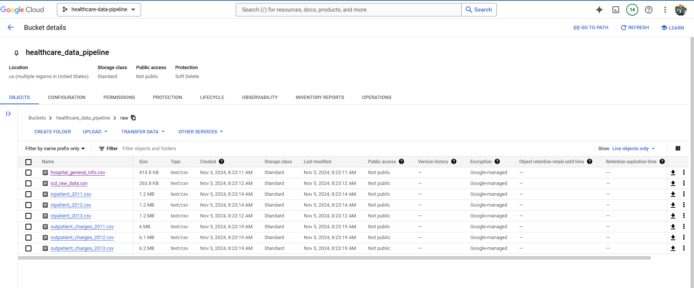

# Healthcare ETL Data Pipeline

This project is an ETL (Extract, Transform, Load) pipeline for processing healthcare data using [Apache Airflow](https://airflow.apache.org/). The pipeline automates tasks for data extraction, transformation, and loading into Google Cloud Storage (GCS) and BigQuery, followed by further processing using DBT (Data Build Tool) and connecting to Power BI for data visualization.

## Project Overview

The pipeline is scheduled to run monthly, starting with file validation and progressing through extraction, transformation, loading, and BigQuery processing. Task groups organize related tasks within the Airflow DAG for better readability and management.

## DAG Structure

- **DAG Name**: `health_etl_data`
- **Description**: A DAG to extract, transform, upload, and process healthcare data.
- **Schedule**: Monthly
- **Owner**: Airflow

## Pipeline Components

### Data Extraction
This group extracts data from multiple sources:

- **`download_google_files`**: Downloads files from Google Drive.
- **`export_sqltables_to_csv`**: Exports data from SQLite tables to CSV files.
- **`extract_icd_data`**: Extracts ICD (International Classification of Diseases) data in JSON format.

### Data Transformation
This group performs necessary transformations:

- **`transform_json_to_csv`**: Converts JSON files to CSV format.
- **`process_inpatient_outpatient_files`**: Processes inpatient and outpatient data files using configuration settings.
- **`hospitalinfo_clean_task`**: Cleans hospital information data.

### Upload to GCS

Uploads CSV files to designated Google Cloud Storage (GCS) buckets and paths for later BigQuery loading.

### BigQuery and DBT Processing

Loads data into BigQuery and processes it further with DBT models:

- **BigQuery Dataset Creation**: Creates datasets for raw and transformed healthcare data.
- **`gcs_to_raw` Tasks**: Loads CSV files from GCS into BigQuery tables in the `healthcare_raw` dataset.
- **DBT Transformation**: Uses DBT to transform and organize data in BigQuery, preparing it for downstream analysis.

### Connecting BigQuery with Power BI
Once the data is stored in BigQuery, it connects to Power BI for creating an interactive healthcare dashboard:

1. **Set Up Power BI Connection**:
   - In Power BI Desktop, select **Get Data** > **Google BigQuery**.
   - Authenticate with the Google account associated with the GCP project.

2. **Select and Transform Data**:
   - Navigate to the `healthcare_transformed` dataset in BigQuery and import relevant tables.
   - Apply transformations in Power BI as needed (e.g., renaming columns, adjusting data types).

3. **Design Power BI Dashboard**:
   - Use Power BI's tools to design visuals, such as charts for healthcare trends, KPIs for metrics, and filters for dynamic data analysis.

4. **Publish and Share**:
   - Publish the dashboard to the Power BI Service for online access.
   - Schedule automatic data refreshes to keep the dashboard up-to-date with BigQuery data.

## Dashboard

An interactive Power BI dashboard will provide insights into healthcare data trends and metrics.

## Prerequisites

- **Apache Airflow** with providers for `google-cloud`, `astro`, and `cosmos`
- **Google Cloud Storage** and **BigQuery** credentials configured in Airflow as `gcp` connection
- **DBT** project and profiles configured for BigQuery
- **Power BI Desktop** and **Power BI Pro** for publishing

## Environment Setup

1. Install dependencies in Airflow.
2. Configure GCP credentials in Airflow and ensure the `gcp` connection is properly set up.
3. Set up the `/usr/local/airflow/include/` directory for scripts, datasets, and config files.

## Execution

The pipeline can be triggered manually or scheduled monthly, following DAG-defined dependencies. Task delays are added where necessary to prevent race conditions.

## File Structure

- **DAG File**: `dags/health_etl_data.py`
- **Config Files**: `/usr/local/airflow/include/scripts/config.txt`
- **Data Sources**: `/usr/local/airflow/include/sources/`
- **Transformed Data**: BigQuery `healthcare_transformed` dataset

## Project Structure Breakdown

1. **dags/**: Contains Airflow DAGs for orchestrating tasks in data pipelines.
   - **__pycache__/**: Python bytecode cache for improved loading times.
   - **.airflowignore**: Excludes specific files or directories from DAG processing to optimize performance.
   - **health_data_pipeline.py**: A DAG script for healthcare data processing, covering ETL phases.

2. **include/**: Supplementary modules, config files, and data resources.
   - **dataset/**: Raw or intermediate datasets for transformation and upload to GCS and BigQuery.
   - **dbt/**: DBT models, configurations, and SQL/YAML scripts for transforming data within BigQuery.
   - **gcp/**: Configuration files (e.g., service account keys) for Google Cloud services integration.
   - **images/**: Stores documentation and dashboard-related images.
   - **powerbi/**:
     - `healthcare_dashboard.pbix`: Main Power BI dashboard file.
     - `report file`: Power BI report file.

3. **scripts/**: Custom scripts for tasks like data cleaning, transformations, and automation.
4. **sources/**: Contains connectors or references to primary data sources (e.g., database & CSV/JSON files). 

